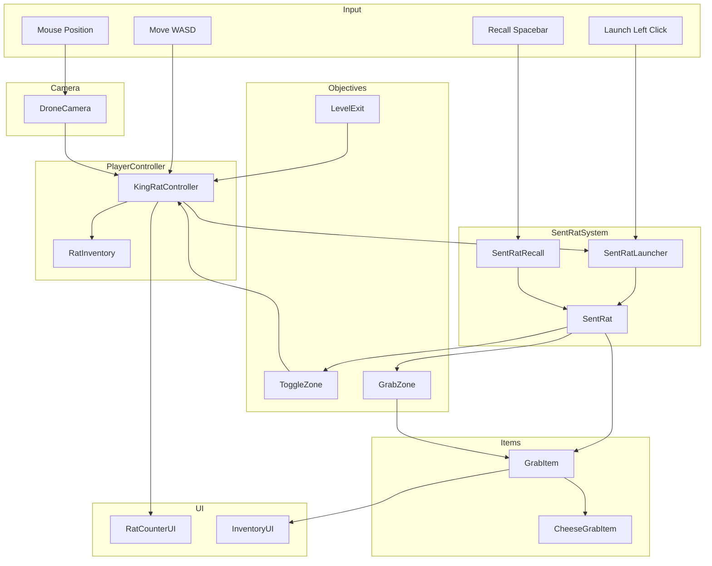
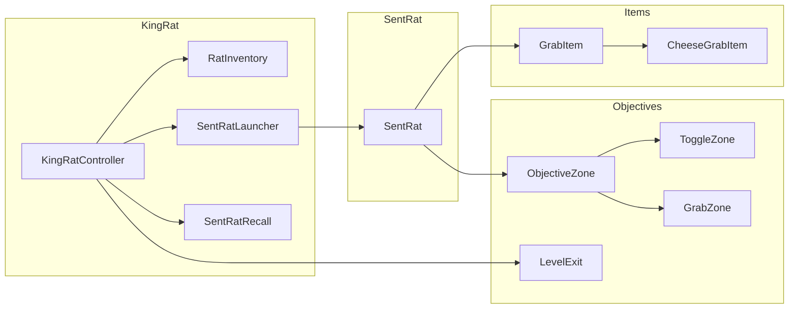

# Finder's Cheesers - Technical Coding Guide

This document provides a comprehensive technical coding guide for implementing the Finder's Cheesers prototype. It combines game design specifications with Unity best practices, InputSystem integration, Cinemachine 3 usage, and Kilo Agent coding guidelines.

---

## Table of Contents

1. [Game Overview](#game-overview)
2. [Project Structure](#project-structure)
3. [Core Game Systems](#core-game-systems)
4. [Input System Integration](#input-system-integration)
5. [Camera System (Cinemachine 3)](#camera-system-cinemachine-3)
6. [Coding Standards](#coding-standards)
7. [Component Architecture](#component-architecture)
8. [Implementation Patterns](#implementation-patterns)

---

## Game Overview

### Game Type
Third-person strategy-puzzle game with an aerial, drone-like camera view.

### Core Mechanics

#### Player Controller (KingRat)
- **Movement**: WASD keys control movement
- **Camera**: Fixed aerial drone-like view (not player-controlled)
- **Mouse Cursor**: Shows a small circular reticle in the world
- **Minimum Rats**: Requires at least 2 rats to move
- **Speed Scaling**: Movement speed scales with rat count (100% at full rats, 25% at 2 rats)

#### SentRat System
- **Launch**: Left-click launches a SentRat from KingRat to the reticle position
- **Character**: Rigidbody3D cube
- **Recall**: Spacebar recalls all SentRats back to KingRat
- **Rats Variable**: Tracks available rats (decreases on launch, increases on recall)

#### Objective Zones
Two types of objective zones:

| Type | Visual | Function | Reversibility |
|------|--------|----------|---------------|
| **Toggle** | Teal flashing circle | Changes boolean value | Yes |
| **Grab** | Purple flashing circle | Attaches item with `_grab` suffix | No |

#### Special Items
- **Cheese_grab**: Small yellow sphere that increases Rats variable when recalled

#### Level Completion
- **Exit Trigger**: Green square that ends the level when touched by KingRat

---

## Project Structure

```
Finder's Cheesers/
├── Assets/
│   ├── InputActions/           # Input System action maps
│   │   ├── InputSystem_Actions.inputactions
│   │   └── InputSystem_GameActions.inputactions
│   ├── Scripts/                # All C# scripts
│   │   ├── Player/             # Player controller scripts
│   │   │   ├── KingRatController.cs
│   │   │   ├── SentRatLauncher.cs
│   │   │   └── RatInventory.cs
│   │   ├── SentRat/            # SentRat character scripts
│   │   │   ├── SentRat.cs
│   │   │   ├── SentRatRecall.cs
│   │   │   └── SentRatPhysics.cs
│   │   ├── Objectives/         # Objective zone scripts
│   │   │   ├── ObjectiveZone.cs
│   │   │   ├── ToggleZone.cs
│   │   │   ├── GrabZone.cs
│   │   │   └── LevelExit.cs
│   │   ├── Items/              # Grab items
│   │   │   ├── GrabItem.cs
│   │   │   └── CheeseGrabItem.cs
│   │   ├── Camera/             # Camera scripts
│   │   │   └── DroneCamera.cs
│   │   └── UI/                 # UI scripts
│   │       ├── RatCounterUI.cs
│   │       └── InventoryUI.cs
│   ├── Prefabs/                # Prefab objects
│   │   ├── KingRat.prefab
│   │   ├── SentRat.prefab
│   │   ├── ToggleZone.prefab
│   │   ├── GrabZone.prefab
│   │   └── CheeseGrabItem.prefab
│   ├── Materials/              # Materials
│   ├── Textures/               # Textures
│   ├── FBX/                    # 3D models
│   ├── Settings/               # Settings assets
│   └── Scenes/                 # Unity scenes
│       └── SampleScene.unity
├── Packages/
│   └── manifest.json
├── ProjectSettings/
└── Documentation/
    ├── INPUTSYSTEM_README.md
    ├── CINEMACHINE3_README.md
    ├── KILO_AGENT_README.md
    └── FINDERS_CHEESERS_TECHNICAL_GUIDE.md
```

---

## Core Game Systems

### System Architecture Diagram



### 1. KingRat Controller System

#### KingRatController.cs

The main player controller that handles movement and rat management.

```csharp
using UnityEngine;
using UnityEngine.InputSystem;
using Unity.Cinemachine;

namespace FindersCheesers.Player
{
    /// <summary>
    /// Main player controller for KingRat character.
    /// Handles WASD movement and rat-dependent speed scaling.
    /// </summary>
    [AddComponentMenu("Finder's Cheesers/Player/KingRat Controller")]
    public class KingRatController : MonoBehaviour
    {
        [Header("Input References")]
        [SerializeField] private InputActionReference moveActionReference;
        
        [Header("Movement Settings")]
        [SerializeField] private float baseMoveSpeed = 5f;
        [SerializeField] private int maxRats = 10;
        [SerializeField] private int minRatsToMove = 2;
        
        [Header("Camera")]
        [SerializeField] private CinemachineCamera droneCamera;
        
        // Components
        private PlayerInput playerInput;
        private InputAction moveAction;
        private CharacterController characterController;
        
        // State
        private Vector2 moveInput;
        private int currentRats;
        private bool canMove;
        
        // Events
        public event System.Action<int> OnRatsChanged;
        public event System.Action<bool> OnCanMoveChanged;
        
        private void Awake()
        {
            // Get PlayerInput from singleton or component
            playerInput = GetComponent<PlayerInput>();
            characterController = GetComponent<CharacterController>();
            
            // Initialize with max rats
            currentRats = maxRats;
            UpdateCanMove();
        }
        
        private void OnEnable()
        {
            if (playerInput != null && moveActionReference != null)
            {
                moveAction = playerInput.actions.FindAction(moveActionReference.action.id);
                if (moveAction != null)
                {
                    moveAction.performed += OnMovePerformed;
                    moveAction.canceled += OnMoveCanceled;
                }
            }
        }
        
        private void OnDisable()
        {
            if (moveAction != null)
            {
                moveAction.performed -= OnMovePerformed;
                moveAction.canceled -= OnMoveCanceled;
            }
        }
        
        private void OnMovePerformed(InputAction.CallbackContext context)
        {
            moveInput = context.ReadValue<Vector2>();
        }
        
        private void OnMoveCanceled(InputAction.CallbackContext context)
        {
            moveInput = Vector2.zero;
        }
        
        private void Update()
        {
            if (canMove && moveInput != Vector2.zero)
            {
                HandleMovement();
            }
        }
        
        private void HandleMovement()
        {
            // Calculate speed based on rat count
            float speedMultiplier = CalculateSpeedMultiplier();
            float currentSpeed = baseMoveSpeed * speedMultiplier;
            
            // Get camera-relative movement direction
            Vector3 forward = droneCamera.transform.forward;
            forward.y = 0;
            forward.Normalize();
            
            Vector3 right = droneCamera.transform.right;
            right.y = 0;
            right.Normalize();
            
            Vector3 moveDirection = (forward * moveInput.y + right * moveInput.x).normalized;
            
            // Apply movement
            characterController.Move(moveDirection * currentSpeed * Time.deltaTime);
        }
        
        private float CalculateSpeedMultiplier()
        {
            // Scale from 25% at minRatsToMove to 100% at maxRats
            float ratio = (float)(currentRats - minRatsToMove) / (maxRats - minRatsToMove);
            return 0.25f + (0.75f * Mathf.Clamp01(ratio));
        }
        
        private void UpdateCanMove()
        {
            canMove = currentRats >= minRatsToMove;
            OnCanMoveChanged?.Invoke(canMove);
        }
        
        /// <summary>
        /// Decreases rat count when a SentRat is launched.
        /// </summary>
        public void DecreaseRats()
        {
            currentRats = Mathf.Max(0, currentRats - 1);
            UpdateCanMove();
            OnRatsChanged?.Invoke(currentRats);
        }
        
        /// <summary>
        /// Increases rat count when a SentRat is recalled.
        /// </summary>
        public void IncreaseRats()
        {
            currentRats = Mathf.Min(maxRats, currentRats + 1);
            UpdateCanMove();
            OnRatsChanged?.Invoke(currentRats);
        }
        
        /// <summary>
        /// Gets the current rat count.
        /// </summary>
        public int GetCurrentRats() => currentRats;
        
        /// <summary>
        /// Gets whether the player can currently move.
        /// </summary>
        public bool CanMove() => canMove;
        
        /// <summary>
        /// Gets the transform for SentRats to return to.
        /// </summary>
        public Transform GetReturnTarget() => transform;
    }
}
```

#### RatInventory.cs

Manages the inventory of grabbed items.

```csharp
using UnityEngine;
using System.Collections.Generic;

namespace FindersCheesers.Player
{
    /// <summary>
    /// Manages the inventory of items grabbed by SentRats.
    /// </summary>
    [AddComponentMenu("Finder's Cheesers/Player/Rat Inventory")]
    public class RatInventory : MonoBehaviour
    {
        [System.Serializable]
        public class InventoryItem
        {
            public string itemName;
            public Sprite icon;
            public int quantity;
        }
        
        private List<InventoryItem> inventory = new List<InventoryItem>();
        
        // Events
        public event System.Action<List<InventoryItem>> OnInventoryChanged;
        
        /// <summary>
        /// Adds an item to the inventory when a SentRat recalls with a grabbed item.
        /// </summary>
        public void AddItem(string itemName, Sprite icon)
        {
            // Check if item already exists
            InventoryItem existingItem = inventory.Find(item => item.itemName == itemName);
            
            if (existingItem != null)
            {
                existingItem.quantity++;
            }
            else
            {
                inventory.Add(new InventoryItem
                {
                    itemName = itemName,
                    icon = icon,
                    quantity = 1
                });
            }
            
            OnInventoryChanged?.Invoke(inventory);
        }
        
        /// <summary>
        /// Gets the current inventory.
        /// </summary>
        public List<InventoryItem> GetInventory() => inventory;
        
        /// <summary>
        /// Checks if the inventory contains a specific item.
        /// </summary>
        public bool HasItem(string itemName)
        {
            return inventory.Exists(item => item.itemName == itemName && item.quantity > 0);
        }
    }
}
```

### 2. SentRat System

#### SentRatLauncher.cs

Handles launching SentRats from KingRat to the reticle position.

```csharp
using UnityEngine;
using UnityEngine.InputSystem;

namespace FindersCheesers.SentRat
{
    /// <summary>
    /// Handles launching SentRats from KingRat to the mouse reticle position.
    /// </summary>
    [AddComponentMenu("Finder's Cheesers/SentRat/SentRat Launcher")]
    public class SentRatLauncher : MonoBehaviour
    {
        [Header("Input References")]
        [SerializeField] private InputActionReference launchActionReference;
        [SerializeField] private InputActionReference pointActionReference;
        
        [Header("Prefabs")]
        [SerializeField] private GameObject sentRatPrefab;
        
        [Header("Settings")]
        [SerializeField] private float launchSpeed = 20f;
        [SerializeField] private float launchHeight = 1f;
        
        // Components
        private PlayerInput playerInput;
        private InputAction launchAction;
        private InputAction pointAction;
        private Camera mainCamera;
        private KingRatController kingRatController;
        
        // Active SentRats
        private List<SentRat> activeSentRats = new List<SentRat>();
        
        // Events
        public event System.Action<SentRat> OnSentRatLaunched;
        
        private void Awake()
        {
            playerInput = GetComponent<PlayerInput>();
            mainCamera = Camera.main;
            kingRatController = GetComponent<KingRatController>();
        }
        
        private void OnEnable()
        {
            if (playerInput != null)
            {
                if (launchActionReference != null)
                {
                    launchAction = playerInput.actions.FindAction(launchActionReference.action.id);
                    if (launchAction != null)
                    {
                        launchAction.performed += OnLaunchPerformed;
                    }
                }
                
                if (pointActionReference != null)
                {
                    pointAction = playerInput.actions.FindAction(pointActionReference.action.id);
                }
            }
        }
        
        private void OnDisable()
        {
            if (launchAction != null)
            {
                launchAction.performed -= OnLaunchPerformed;
            }
        }
        
        private void OnLaunchPerformed(InputAction.CallbackContext context)
        {
            // Check if we have rats available
            if (kingRatController != null && kingRatController.GetCurrentRats() > 0)
            {
                LaunchSentRat();
            }
        }
        
        private void LaunchSentRat()
        {
            // Get mouse position in world space
            Vector2 mousePosition = pointAction != null ? pointAction.ReadValue<Vector2>() : Vector2.zero;
            Vector3 targetPosition = GetWorldPositionFromMouse(mousePosition);
            
            // Calculate launch direction
            Vector3 launchDirection = (targetPosition - transform.position).normalized;
            launchDirection.y = 0; // Keep horizontal
            
            // Spawn SentRat
            GameObject sentRatObj = Instantiate(sentRatPrefab, transform.position + Vector3.up * launchHeight, Quaternion.identity);
            SentRat sentRat = sentRatObj.GetComponent<SentRat>();
            
            if (sentRat != null)
            {
                sentRat.Initialize(this, kingRatController.GetReturnTarget(), launchDirection * launchSpeed);
                activeSentRats.Add(sentRat);
                
                // Decrease rat count
                kingRatController.DecreaseRats();
                
                OnSentRatLaunched?.Invoke(sentRat);
            }
        }
        
        private Vector3 GetWorldPositionFromMouse(Vector2 mousePosition)
        {
            // Raycast from camera to ground plane
            Ray ray = mainCamera.ScreenPointToRay(mousePosition);
            Plane groundPlane = new Plane(Vector3.up, Vector3.zero);
            
            if (groundPlane.Raycast(ray, out float distance))
            {
                return ray.GetPoint(distance);
            }
            
            return transform.position;
        }
        
        /// <summary>
        /// Called by SentRat when it is recalled.
        /// </summary>
        public void OnSentRatRecalled(SentRat sentRat)
        {
            activeSentRats.Remove(sentRat);
        }
        
        /// <summary>
        /// Gets all active SentRats.
        /// </summary>
        public List<SentRat> GetActiveSentRats() => activeSentRats;
    }
}
```

#### SentRat.cs

The SentRat character that can be launched and recalled.

```csharp
using UnityEngine;

namespace FindersCheesers.SentRat
{
    /// <summary>
    /// SentRat character that can be launched, interact with objectives, and be recalled.
    /// </summary>
    [AddComponentMenu("Finder's Cheesers/SentRat/SentRat")]
    public class SentRat : MonoBehaviour
    {
        [Header("Components")]
        [SerializeField] private Rigidbody rb;
        
        [Header("Settings")]
        [SerializeField] private float recallSpeed = 15f;
        [SerializeField] private float stopDistance = 0.5f;
        
        // State
        private Transform returnTarget;
        private Vector3 initialVelocity;
        private bool isRecalled;
        private bool isMovingToTarget;
        private GrabItem attachedItem;
        
        // References
        private SentRatLauncher launcher;
        private KingRatController kingRatController;
        private RatInventory ratInventory;
        
        /// <summary>
        /// Initializes the SentRat with launcher and target references.
        /// </summary>
        public void Initialize(SentRatLauncher launcher, Transform returnTarget, Vector3 velocity)
        {
            this.launcher = launcher;
            this.returnTarget = returnTarget;
            this.initialVelocity = velocity;
            
            // Get references
            kingRatController = returnTarget.GetComponent<KingRatController>();
            ratInventory = returnTarget.GetComponent<RatInventory>();
            
            // Apply initial velocity
            if (rb != null)
            {
                rb.linearVelocity = initialVelocity;
            }
            
            // Stop after a short time
            Invoke(nameof(StopMovement), 0.5f);
        }
        
        private void StopMovement()
        {
            if (rb != null)
            {
                rb.linearVelocity = Vector3.zero;
                rb.angularVelocity = Vector3.zero;
            }
        }
        
        private void Update()
        {
            if (isRecalled && isMovingToTarget)
            {
                MoveToReturnTarget();
            }
        }
        
        private void MoveToReturnTarget()
        {
            if (returnTarget == null) return;
            
            Vector3 direction = (returnTarget.position - transform.position).normalized;
            transform.position += direction * recallSpeed * Time.deltaTime;
            
            // Check if reached target
            if (Vector3.Distance(transform.position, returnTarget.position) < stopDistance)
            {
                OnReachedReturnTarget();
            }
        }
        
        private void OnReachedReturnTarget()
        {
            // Handle attached item
            if (attachedItem != null && ratInventory != null)
            {
                ratInventory.AddItem(attachedItem.ItemName, attachedItem.Icon);
                
                // Check if it's a cheese item for extra rat
                CheeseGrabItem cheeseItem = attachedItem.GetComponent<CheeseGrabItem>();
                if (cheeseItem != null && kingRatController != null)
                {
                    kingRatController.IncreaseRats();
                }
            }
            
            // Increase rat count
            if (kingRatController != null)
            {
                kingRatController.IncreaseRats();
            }
            
            // Notify launcher
            if (launcher != null)
            {
                launcher.OnSentRatRecalled(this);
            }
            
            // Destroy SentRat
            Destroy(gameObject);
        }
        
        /// <summary>
        /// Recalls the SentRat back to KingRat.
        /// </summary>
        public void Recall()
        {
            isRecalled = true;
            isMovingToTarget = true;
            
            // Disable physics
            if (rb != null)
            {
                rb.isKinematic = true;
            }
        }
        
        /// <summary>
        /// Attaches a grab item to this SentRat.
        /// </summary>
        public void AttachItem(GrabItem item)
        {
            attachedItem = item;
            item.AttachToSentRat(transform);
        }
        
        private void OnTriggerEnter(Collider other)
        {
            // Check for objective zones
            ObjectiveZone objectiveZone = other.GetComponent<ObjectiveZone>();
            if (objectiveZone != null)
            {
                objectiveZone.OnSentRatEnter(this);
            }
        }
    }
}
```

#### SentRatRecall.cs

Handles recalling all SentRats with the spacebar.

```csharp
using UnityEngine;
using UnityEngine.InputSystem;

namespace FindersCheesers.SentRat
{
    /// <summary>
    /// Handles recalling all active SentRats with the spacebar.
    /// </summary>
    [AddComponentMenu("Finder's Cheesers/SentRat/SentRat Recall")]
    public class SentRatRecall : MonoBehaviour
    {
        [Header("Input References")]
        [SerializeField] private InputActionReference recallActionReference;
        
        // Components
        private PlayerInput playerInput;
        private InputAction recallAction;
        private SentRatLauncher sentRatLauncher;
        
        private void Awake()
        {
            playerInput = GetComponent<PlayerInput>();
            sentRatLauncher = GetComponent<SentRatLauncher>();
        }
        
        private void OnEnable()
        {
            if (playerInput != null && recallActionReference != null)
            {
                recallAction = playerInput.actions.FindAction(recallActionReference.action.id);
                if (recallAction != null)
                {
                    recallAction.performed += OnRecallPerformed;
                }
            }
        }
        
        private void OnDisable()
        {
            if (recallAction != null)
            {
                recallAction.performed -= OnRecallPerformed;
            }
        }
        
        private void OnRecallPerformed(InputAction.CallbackContext context)
        {
            RecallAllSentRats();
        }
        
        private void RecallAllSentRats()
        {
            if (sentRatLauncher != null)
            {
                foreach (SentRat sentRat in sentRatLauncher.GetActiveSentRats())
                {
                    if (sentRat != null)
                    {
                        sentRat.Recall();
                    }
                }
            }
        }
    }
}
```

### 3. Objective Zone System

#### ObjectiveZone.cs

Base class for all objective zones.

```csharp
using UnityEngine;

namespace FindersCheesers.Objectives
{
    /// <summary>
    /// Base class for objective zones that SentRats can interact with.
    /// </summary>
    [AddComponentMenu("Finder's Cheesers/Objectives/Objective Zone")]
    public abstract class ObjectiveZone : MonoBehaviour
    {
        [Header("Visuals")]
        [SerializeField] private float flashSpeed = 1f;
        [SerializeField] private Color baseColor;
        [SerializeField] private Color flashColor;
        
        [Header("Trigger")]
        [SerializeField] private Collider triggerCollider;
        
        // Components
        private Renderer zoneRenderer;
        private Material zoneMaterial;
        
        // State
        private float flashTimer;
        
        protected virtual void Awake()
        {
            zoneRenderer = GetComponent<Renderer>();
            if (zoneRenderer != null)
            {
                zoneMaterial = zoneRenderer.material;
            }
            
            if (triggerCollider == null)
            {
                triggerCollider = GetComponent<Collider>();
            }
        }
        
        protected virtual void Update()
        {
            UpdateFlashAnimation();
        }
        
        private void UpdateFlashAnimation()
        {
            if (zoneMaterial == null) return;
            
            flashTimer += Time.deltaTime * flashSpeed;
            float lerpValue = (Mathf.Sin(flashTimer) + 1f) * 0.5f;
            zoneMaterial.color = Color.Lerp(baseColor, flashColor, lerpValue);
        }
        
        /// <summary>
        /// Called when a SentRat enters the objective zone.
        /// </summary>
        public abstract void OnSentRatEnter(SentRat sentRat);
    }
}
```

#### ToggleZone.cs

Toggle objective zone that changes boolean values.

```csharp
using UnityEngine;

namespace FindersCheesers.Objectives
{
    /// <summary>
    /// Toggle objective zone that changes boolean values when a SentRat enters.
    /// </summary>
    [AddComponentMenu("Finder's Cheesers/Objectives/Toggle Zone")]
    public class ToggleZone : ObjectiveZone
    {
        [Header("Toggle Settings")]
        [SerializeField] private string toggleID;
        [SerializeField] private bool defaultValue = false;
        
        [Header("Visuals")]
        [SerializeField] private Color tealBaseColor = new Color(0, 0.5f, 0.5f);
        [SerializeField] private Color tealFlashColor = new Color(0, 0.8f, 0.8f);
        
        // State
        private bool currentToggleValue;
        
        // Events
        public event System.Action<string, bool> OnToggleChanged;
        
        protected override void Awake()
        {
            baseColor = tealBaseColor;
            flashColor = tealFlashColor;
            currentToggleValue = defaultValue;
            
            base.Awake();
        }
        
        public override void OnSentRatEnter(SentRat sentRat)
        {
            // Toggle the boolean value
            currentToggleValue = !currentToggleValue;
            
            // Notify listeners
            OnToggleChanged?.Invoke(toggleID, currentToggleValue);
            
            Debug.Log($"[ToggleZone] {toggleID} toggled to {currentToggleValue}");
        }
        
        /// <summary>
        /// Gets the current toggle value.
        /// </summary>
        public bool GetToggleValue() => currentToggleValue;
        
        /// <summary>
        /// Sets the toggle value directly.
        /// </summary>
        public void SetToggleValue(bool value)
        {
            currentToggleValue = value;
        }
    }
}
```

#### GrabZone.cs

Grab objective zone that attaches items to SentRats.

```csharp
using UnityEngine;

namespace FindersCheesers.Objectives
{
    /// <summary>
    /// Grab objective zone that attaches items to SentRats when they enter.
    /// </summary>
    [AddComponentMenu("Finder's Cheesers/Objectives/Grab Zone")]
    public class GrabZone : ObjectiveZone
    {
        [Header("Grab Settings")]
        [SerializeField] private GrabItem grabItemPrefab;
        [SerializeField] private bool oneTimeUse = true;
        
        [Header("Visuals")]
        [SerializeField] private Color purpleBaseColor = new Color(0.5f, 0, 0.5f);
        [SerializeField] private Color purpleFlashColor = new Color(0.8f, 0, 0.8f);
        
        // State
        private bool hasBeenGrabbed;
        
        // Events
        public event System.Action<string> OnItemGrabbed;
        
        protected override void Awake()
        {
            baseColor = purpleBaseColor;
            flashColor = purpleFlashColor;
            hasBeenGrabbed = false;
            
            base.Awake();
        }
        
        public override void OnSentRatEnter(SentRat sentRat)
        {
            if (hasBeenGrabbed && oneTimeUse) return;
            
            // Spawn and attach the grab item
            if (grabItemPrefab != null)
            {
                GrabItem grabItem = Instantiate(grabItemPrefab, transform.position, Quaternion.identity);
                sentRat.AttachItem(grabItem);
                
                hasBeenGrabbed = true;
                
                // Notify listeners
                OnItemGrabbed?.Invoke(grabItem.ItemName);
                
                Debug.Log($"[GrabZone] Item {grabItem.ItemName} grabbed by SentRat");
            }
        }
        
        /// <summary>
        /// Resets the grab zone for reuse.
        /// </summary>
        public void ResetGrabZone()
        {
            hasBeenGrabbed = false;
        }
    }
}
```

#### LevelExit.cs

Level exit trigger that ends the level.

```csharp
using UnityEngine;
using UnityEngine.SceneManagement;

namespace FindersCheesers.Objectives
{
    /// <summary>
    /// Level exit trigger that ends the level when KingRat touches it.
    /// </summary>
    [AddComponentMenu("Finder's Cheesers/Objectives/Level Exit")]
    public class LevelExit : MonoBehaviour
    {
        [Header("Settings")]
        [SerializeField] private string nextSceneName;
        [SerializeField] private float exitDelay = 1f;
        
        [Header("Visuals")]
        [SerializeField] private Color greenColor = Color.green;
        
        // Components
        private Renderer exitRenderer;
        private Material exitMaterial;
        
        private void Awake()
        {
            exitRenderer = GetComponent<Renderer>();
            if (exitRenderer != null)
            {
                exitMaterial = exitRenderer.material;
                exitMaterial.color = greenColor;
            }
        }
        
        private void OnTriggerEnter(Collider other)
        {
            // Check if KingRat entered
            KingRatController kingRat = other.GetComponent<KingRatController>();
            if (kingRat != null)
            {
                OnKingRatEnter();
            }
        }
        
        private void OnKingRatEnter()
        {
            Debug.Log("[LevelExit] KingRat reached level exit!");
            
            // Load next scene after delay
            if (!string.IsNullOrEmpty(nextSceneName))
            {
                Invoke(nameof(LoadNextScene), exitDelay);
            }
        }
        
        private void LoadNextScene()
        {
            SceneManager.LoadScene(nextSceneName);
        }
    }
}
```

### 4. Item System

#### GrabItem.cs

Base class for items that can be grabbed by SentRats.

```csharp
using UnityEngine;

namespace FindersCheesers.Items
{
    /// <summary>
    /// Base class for items that can be grabbed by SentRats.
    /// </summary>
    [AddComponentMenu("Finder's Cheesers/Items/Grab Item")]
    public class GrabItem : MonoBehaviour
    {
        [Header("Item Settings")]
        [SerializeField] private string itemName;
        [SerializeField] private Sprite icon;
        
        [Header("Visuals")]
        [SerializeField] private GameObject itemModel;
        
        // State
        private bool isAttached;
        private Transform sentRatTransform;
        
        /// <summary>
        /// Gets the item name (should have "_grab" suffix).
        /// </summary>
        public string ItemName => itemName;
        
        /// <summary>
        /// Gets the item icon for UI display.
        /// </summary>
        public Sprite Icon => icon;
        
        /// <summary>
        /// Attaches this item to a SentRat.
        /// </summary>
        public void AttachToSentRat(Transform sentRatTransform)
        {
            this.sentRatTransform = sentRatTransform;
            isAttached = true;
            
            // Parent the item model to the SentRat
            if (itemModel != null)
            {
                itemModel.transform.SetParent(sentRatTransform);
                itemModel.transform.localPosition = Vector3.zero;
            }
        }
        
        protected virtual void Update()
        {
            if (isAttached && sentRatTransform != null)
            {
                transform.position = sentRatTransform.position;
            }
        }
    }
}
```

#### CheeseGrabItem.cs

Special grab item that increases rat count when recalled.

```csharp
using UnityEngine;

namespace FindersCheesers.Items
{
    /// <summary>
    /// Special grab item that increases rat count when recalled.
    /// </summary>
    [AddComponentMenu("Finder's Cheesers/Items/Cheese Grab Item")]
    public class CheeseGrabItem : GrabItem
    {
        [Header("Cheese Settings")]
        [SerializeField] private int ratsAdded = 1;
        
        [Header("Visuals")]
        [SerializeField] private Color cheeseColor = Color.yellow;
        [SerializeField] private float sphereRadius = 0.5f;
        
        /// <summary>
        /// Gets the number of rats added when this cheese is recalled.
        /// </summary>
        public int RatsAdded => ratsAdded;
    }
}
```

### 5. Camera System

#### DroneCamera.cs

Fixed aerial drone-like camera using Cinemachine 3.

```csharp
using UnityEngine;
using Unity.Cinemachine;

namespace FindersCheesers.Camera
{
    /// <summary>
    /// Fixed aerial drone-like camera using Cinemachine 3.
    /// </summary>
    [AddComponentMenu("Finder's Cheesers/Camera/Drone Camera")]
    public class DroneCamera : MonoBehaviour
    {
        [Header("Camera Settings")]
        [SerializeField] private CinemachineCamera virtualCamera;
        [SerializeField] private Transform followTarget;
        
        [Header("Drone Settings")]
        [SerializeField] private float heightOffset = 10f;
        [SerializeField] private float distanceOffset = 5f;
        [SerializeField] private float lookAngle = 60f;
        
        private void Awake()
        {
            // Find CinemachineCamera if not assigned
            if (virtualCamera == null)
            {
                virtualCamera = FindFirstObjectByType<CinemachineCamera>();
            }
        }
        
        private void OnEnable()
        {
            if (virtualCamera != null)
            {
                SetupDroneCamera();
            }
        }
        
        private void SetupDroneCamera()
        {
            // Set follow target
            if (followTarget != null)
            {
                virtualCamera.Follow = followTarget;
                virtualCamera.LookAt = followTarget;
            }
            
            // Configure camera position
            Vector3 cameraOffset = Vector3.back * distanceOffset + Vector3.up * heightOffset;
            virtualCamera.transform.localPosition = cameraOffset;
            
            // Configure field of view
            virtualCamera.Lens.FieldOfView = lookAngle;
            
            // Add subtle noise for drone-like feel
            AddDroneNoise();
        }
        
        private void AddDroneNoise()
        {
            var noise = virtualCamera.GetComponent<CinemachineBasicMultiChannelPerlin>();
            if (noise == null)
            {
                noise = virtualCamera.gameObject.AddComponent<CinemachineBasicMultiChannelPerlin>();
            }
            
            if (noise != null)
            {
                noise.AmplitudeGain = 0.05f;
                noise.FrequencyGain = 0.3f;
            }
        }
        
        /// <summary>
        /// Gets the CinemachineCamera reference.
        /// </summary>
        public CinemachineCamera GetVirtualCamera() => virtualCamera;
    }
}
```

### 6. UI System

#### RatCounterUI.cs

Displays the current rat count.

```csharp
using UnityEngine;
using UnityEngine.UI;

namespace FindersCheesers.UI
{
    /// <summary>
    /// UI component that displays the current rat count.
    /// </summary>
    [AddComponentMenu("Finder's Cheesers/UI/Rat Counter UI")]
    public class RatCounterUI : MonoBehaviour
    {
        [Header("UI Elements")]
        [SerializeField] private Text ratCountText;
        [SerializeField] private Slider ratCountSlider;
        
        [Header("Settings")]
        [SerializeField] private int maxRats = 10;
        
        private void Start()
        {
            // Find KingRatController and subscribe to events
            KingRatController kingRat = FindFirstObjectByType<KingRatController>();
            if (kingRat != null)
            {
                kingRat.OnRatsChanged += UpdateRatCount;
                UpdateRatCount(kingRat.GetCurrentRats());
            }
        }
        
        private void OnDestroy()
        {
            // Unsubscribe from events
            KingRatController kingRat = FindFirstObjectByType<KingRatController>();
            if (kingRat != null)
            {
                kingRat.OnRatsChanged -= UpdateRatCount;
            }
        }
        
        private void UpdateRatCount(int currentRats)
        {
            // Update text
            if (ratCountText != null)
            {
                ratCountText.text = $"Rats: {currentRats}/{maxRats}";
            }
            
            // Update slider
            if (ratCountSlider != null)
            {
                ratCountSlider.maxValue = maxRats;
                ratCountSlider.value = currentRats;
            }
        }
    }
}
```

#### InventoryUI.cs

Displays the inventory of grabbed items.

```csharp
using UnityEngine;
using UnityEngine.UI;
using System.Collections.Generic;

namespace FindersCheesers.UI
{
    /// <summary>
    /// UI component that displays the inventory of grabbed items.
    /// </summary>
    [AddComponentMenu("Finder's Cheesers/UI/Inventory UI")]
    public class InventoryUI : MonoBehaviour
    {
        [Header("UI Elements")]
        [SerializeField] private Transform inventoryContainer;
        [SerializeField] private GameObject inventoryItemPrefab;
        
        private void Start()
        {
            // Find RatInventory and subscribe to events
            RatInventory ratInventory = FindFirstObjectByType<RatInventory>();
            if (ratInventory != null)
            {
                ratInventory.OnInventoryChanged += UpdateInventoryUI;
                UpdateInventoryUI(ratInventory.GetInventory());
            }
        }
        
        private void OnDestroy()
        {
            // Unsubscribe from events
            RatInventory ratInventory = FindFirstObjectByType<RatInventory>();
            if (ratInventory != null)
            {
                ratInventory.OnInventoryChanged -= UpdateInventoryUI;
            }
        }
        
        private void UpdateInventoryUI(List<RatInventory.InventoryItem> inventory)
        {
            // Clear existing items
            foreach (Transform child in inventoryContainer)
            {
                Destroy(child.gameObject);
            }
            
            // Create new inventory items
            foreach (RatInventory.InventoryItem item in inventory)
            {
                if (inventoryItemPrefab != null)
                {
                    GameObject itemObj = Instantiate(inventoryItemPrefab, inventoryContainer);
                    
                    // Set icon
                    Image iconImage = itemObj.GetComponentInChildren<Image>();
                    if (iconImage != null)
                    {
                        iconImage.sprite = item.icon;
                    }
                    
                    // Set quantity text
                    Text quantityText = itemObj.GetComponentInChildren<Text>();
                    if (quantityText != null)
                    {
                        quantityText.text = item.quantity.ToString();
                    }
                }
            }
        }
    }
}
```

---

## Input System Integration

### Required Input Actions

Based on the game design, the following input actions are required:

| Action Name | Type | Binding | Purpose |
|-------------|------|---------|---------|
| **Move** | Value | WASD | KingRat movement |
| **Launch** | Button | Left Mouse Click | Launch SentRat |
| **Recall** | Button | Spacebar | Recall all SentRats |
| **Point** | Value | Mouse Position | Reticle position |

### Input System Pattern

Follow the pattern from [`INPUTSYSTEM_README.md`](Finder's Cheesers/INPUTSYSTEM_README.md):

```csharp
using UnityEngine.InputSystem;

public class YourScript : MonoBehaviour
{
    [SerializeField]
    private InputActionReference yourActionReference;
    
    private InputAction yourAction;
    private PlayerInput playerInput;
    
    private void Awake()
    {
        playerInput = GetComponent<PlayerInput>();
    }
    
    private void OnEnable()
    {
        if (playerInput != null)
        {
            // CRITICAL: Use FindAction with the ID from the InputActionReference
            yourAction = playerInput.actions.FindAction(yourActionReference.action.id);
            
            // Subscribe to input events
            if (yourAction != null)
            {
                yourAction.performed += OnYourActionPerformed;
            }
        }
    }
    
    private void OnDisable()
    {
        if (yourAction != null)
        {
            yourAction.performed -= OnYourActionPerformed;
        }
    }
    
    private void OnYourActionPerformed(InputAction.CallbackContext context)
    {
        // Handle the action
    }
}
```

### Input Action Event Types

- **started**: Fires when a button is pressed or action begins
- **performed**: Fires when an action is performed
- **canceled**: Fires when a button is released or action ends

For continuous actions like movement, read values in `Update()`:
```csharp
private void Update()
{
    if (moveAction != null)
    {
        Vector2 inputValue = moveAction.ReadValue<Vector2>();
        // Use the input value
    }
}
```

---

## Camera System (Cinemachine 3)

### Cinemachine 3 Usage

Follow the guidelines from [`CINEMACHINE3_README.md`](Finder's Cheesers/CINEMACHINE3_README.md):

**IMPORTANT:** Use `Unity.Cinemachine` namespace, NOT `Cinemachine` (legacy).

```csharp
using Unity.Cinemachine;

public class DroneCamera : MonoBehaviour
{
    [Tooltip("Cinemachine Virtual Camera for the player.")]
    public CinemachineCamera virtualCamera;
    
    private void Awake()
    {
        // Find CinemachineCamera in scene if not assigned
        if (virtualCamera == null)
        {
            virtualCamera = FindFirstObjectByType<CinemachineCamera>();
        }
    }
    
    private void OnEnable()
    {
        if (virtualCamera != null)
        {
            // Set follow target
            virtualCamera.Follow = playerTransform;
            virtualCamera.LookAt = null;
            
            // Configure field of view
            virtualCamera.Lens.FieldOfView = settings.cameraFOV;
        }
    }
}
```

### Cinemachine 3 Components

| Component | Purpose |
|-----------|---------|
| `CinemachineCamera` | Main virtual camera |
| `CinemachineBrain` | Camera brain on main camera |
| `CinemachineImpulseListener` | Camera shake |
| `CinemachineBasicMultiChannelPerlin` | Procedural noise |

### ❌ Legacy Components to Avoid

```csharp
// ❌ WRONG - Legacy Cinemachine 2.x
using Cinemachine;
private CinemachineVirtualCamera virtualCamera;  // Legacy

// ✅ CORRECT - Cinemachine 3.x
using Unity.Cinemachine;
private CinemachineCamera virtualCamera;  // Cinemachine 3
```

---

## Coding Standards

### C# Naming Conventions

| Type | Convention | Example |
|------|------------|---------|
| Classes/Structs | PascalCase | `KingRatController` |
| Methods | PascalCase | `GetCurrentRats()` |
| Properties | PascalCase | `CanMove` |
| Fields | camelCase | `currentRats` |
| Private fields | Prefix with `_` | `_moveSpeed` |
| Constants | PascalCase | `MaxRats` |
| Interfaces | Prefix with `I` | `IObjective` |

### File Organization

- One class per file
- File name must match class name
- Place files in appropriate directories under `Assets/Scripts/`
- Use `AddComponentMenu` attribute for better Unity Inspector organization

### Unity Object API (Unity 6000.0+)

Use new Object API methods:

```csharp
// ✅ CORRECT - New Object API
T obj = FindFirstObjectByType<T>();
T[] objects = FindObjectsByType<T>(FindObjectsInactive.Exclude, FindObjectsSortMode.None);

// ❌ WRONG - Deprecated methods
T obj = FindObjectOfType<T>();
T[] objects = FindObjectsOfType<T>();
```

### Unity Object Null Checking

**CRITICAL:** Do NOT use null propagation (?.) with Unity objects.

```csharp
// ❌ WRONG - Using null propagation with Unity objects
myComponent?.MyMethod();

// ✅ CORRECT - Explicit null checks
if (myComponent != null)
{
    myComponent.MyMethod();
}
```

### Meta Files

**CRITICAL:** Do NOT create `.meta` files manually. Unity automatically generates them.

---

## Component Architecture

### Component Dependencies



### Component Communication Patterns

#### Event Pattern

```csharp
public class KingRatController : MonoBehaviour
{
    public event System.Action<int> OnRatsChanged;
    public event System.Action<bool> OnCanMoveChanged;
    
    private void UpdateRats(int newCount)
    {
        currentRats = newCount;
        OnRatsChanged?.Invoke(currentRats);
    }
}
```

#### Direct Reference Pattern

```csharp
public class SentRatLauncher : MonoBehaviour
{
    private KingRatController kingRatController;
    
    private void Awake()
    {
        kingRatController = GetComponent<KingRatController>();
    }
}
```

#### Find Pattern (Last Resort)

```csharp
public class RatCounterUI : MonoBehaviour
{
    private void Start()
    {
        KingRatController kingRat = FindFirstObjectByType<KingRatController>();
        if (kingRat != null)
        {
            kingRat.OnRatsChanged += UpdateRatCount;
        }
    }
}
```

---

## Implementation Patterns

### 1. Singleton Pattern (Use Sparingly)

```csharp
public class GameManager : MonoBehaviour
{
    public static GameManager Instance { get; private set; }

    private void Awake()
    {
        if (Instance != null && Instance != this)
        {
            Destroy(gameObject);
            return;
        }
        Instance = this;
    }
}
```

### 2. State Pattern (For Complex Abilities)

```csharp
public enum SentRatState
{
    Idle,
    Launched,
    Recalled,
    Returning
}

public class SentRat : MonoBehaviour
{
    private SentRatState currentState;

    public void Update()
    {
        switch (currentState)
        {
            case SentRatState.Idle:
                HandleIdle();
                break;
            case SentRatState.Launched:
                HandleLaunched();
                break;
            case SentRatState.Returning:
                HandleReturning();
                break;
        }
    }
}
```

### 3. Object Pooling (For Performance)

```csharp
public class SentRatPool : MonoBehaviour
{
    [SerializeField] private GameObject sentRatPrefab;
    [SerializeField] private int poolSize = 10;
    
    private Queue<GameObject> pool = new Queue<GameObject>();
    
    private void Awake()
    {
        for (int i = 0; i < poolSize; i++)
        {
            GameObject obj = Instantiate(sentRatPrefab);
            obj.SetActive(false);
            pool.Enqueue(obj);
        }
    }
    
    public GameObject GetSentRat()
    {
        if (pool.Count > 0)
        {
            GameObject obj = pool.Dequeue();
            obj.SetActive(true);
            return obj;
        }
        return null;
    }
    
    public void ReturnSentRat(GameObject obj)
    {
        obj.SetActive(false);
        pool.Enqueue(obj);
    }
}
```

---

## Implementation Checklist

### Core Systems
- [ ] KingRatController with WASD movement
- [ ] Rat count tracking and speed scaling
- [ ] SentRatLauncher with mouse reticle targeting
- [ ] SentRat with physics and recall functionality
- [ ] SentRatRecall with spacebar trigger

### Objective Zones
- [ ] ToggleZone with boolean toggling
- [ ] GrabZone with item attachment
- [ ] LevelExit with scene loading

### Item System
- [ ] GrabItem base class
- [ ] CheeseGrabItem with rat bonus
- [ ] Item attachment to SentRats

### Camera System
- [ ] DroneCamera with Cinemachine 3
- [ ] Fixed aerial view
- [ ] Subtle drone noise

### UI System
- [ ] RatCounterUI with text and slider
- [ ] InventoryUI with item display
- [ ] Event subscriptions for updates

### Input System
- [ ] Move action (WASD)
- [ ] Launch action (Left Click)
- [ ] Recall action (Spacebar)
- [ ] Point action (Mouse Position)

---

## Additional Resources

### Documentation
- [Unity Input System](https://docs.unity3d.com/Packages/com.unity.inputsystem@latest)
- [Cinemachine 3.x Documentation](https://docs.unity3d.com/Packages/com.unity.cinemachine@3.0/manual/index.html)
- [Unity Object API](https://docs.unity3d.com/6000.3/Documentation/ScriptReference/Object.html)

### Project-Specific
- [`INPUTSYSTEM_README.md`](Finder's Cheesers/INPUTSYSTEM_README.md) - Input System integration guide
- [`CINEMACHINE3_README.md`](Finder's Cheesers/CINEMACHINE3_README.md) - Cinemachine 3 usage guide
- [`KILO_AGENT_README.md`](Finder's Cheesers/KILO_AGENT_README.md) - Kilo Agent coding guidelines

---

## Summary

This technical coding guide provides a comprehensive foundation for implementing the Finder's Cheesers prototype. Key points to remember:

1. **Follow Unity 6000.0+ Object API** - Use `FindFirstObjectByType<T>()` instead of deprecated methods
2. **Use Cinemachine 3.x** - Import `Unity.Cinemachine`, not `Cinemachine`
3. **Proper Input System Integration** - Use `playerInput.actions.FindAction(inputActionReference.action.id)`
4. **Avoid Null Propagation** - Use explicit `!= null` checks for Unity objects
5. **Never Create Meta Files** - Let Unity generate them automatically
6. **Follow Naming Conventions** - Use PascalCase for classes/methods, camelCase for fields
7. **Use Event Pattern** - Decouple components with events for better architecture

The game design specifies a strategy-puzzle game with rat-based mechanics. Implement the core systems first (KingRat, SentRat, Objectives), then add polish (UI, camera effects, animations).
