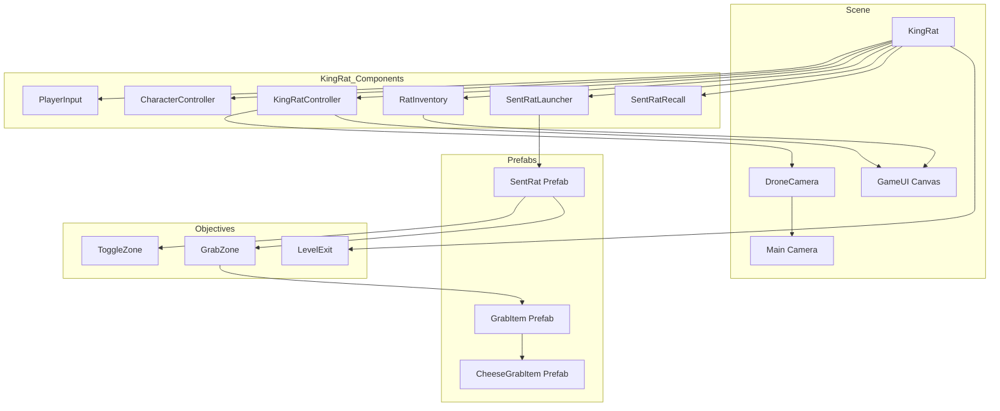

# Scene Setup Guide for Finder's Cheesers

This guide provides step-by-step instructions for designers to set up a playable scene in Finder's Cheesers. Follow these steps to ensure all game systems work correctly.

---

## Table of Contents

1. [Scene Overview](#scene-overview)
2. [Prerequisites](#prerequisites)
3. [Core Scene Setup](#core-scene-setup)
4. [Player Setup (KingRat)](#player-setup-kingrat)
5. [Camera Setup](#camera-setup)
6. [SentRat Prefab Setup](#sentrat-prefab-setup)
7. [Objective Zones Setup](#objective-zones-setup)
8. [Item Prefabs Setup](#item-prefabs-setup)
9. [UI Setup](#ui-setup)
10. [Level Exit Setup](#level-exit-setup)
11. [Testing Checklist](#testing-checklist)
12. [Common Issues](#common-issues)

---

## Scene Overview

A Finder's Cheesers scene requires the following core systems:

| System | Purpose | Required Scripts |
|--------|---------|-----------------|
| **Player** | KingRat character with movement | [`KingRatController`](Assets/Scripts/Player/KingRatController.cs), [`RatInventory`](Assets/Scripts/Player/RatInventory.cs), [`SentRatLauncher`](Assets/Scripts/Player/SentRatLauncher.cs), [`SentRatRecall`](Assets/Scripts/SentRat/SentRatRecall.cs) |
| **Camera** | Aerial drone view | [`DroneCamera`](Assets/Scripts/Camera/DroneCamera.cs) |
| **SentRat** | Launchable rat characters | [`SentRat`](Assets/Scripts/SentRat/SentRat.cs), [`SentRatPhysics`](Assets/Scripts/SentRat/SentRatPhysics.cs) |
| **Objectives** | Interactive zones | [`ToggleZone`](Assets/Scripts/Objectives/ToggleZone.cs), [`GrabZone`](Assets/Scripts/Objectives/GrabZone.cs), [`LevelExit`](Assets/Scripts/Objectives/LevelExit.cs) |
| **Items** | Grabable objects | [`GrabItem`](Assets/Scripts/Items/GrabItem.cs), [`CheeseGrabItem`](Assets/Scripts/Items/CheeseGrabItem.cs) |
| **UI** | Rat counter and inventory | [`RatCounterUI`](Assets/Scripts/UI/RatCounterUI.cs), [`InventoryUI`](Assets/Scripts/UI/InventoryUI.cs) |

---

## Prerequisites

Before setting up a scene, ensure you have:

- **Unity 6000.0+** installed
- **Input System Package** (com.unity.inputsystem)
- **Cinemachine 3.x** Package (com.unity.cinemachine)
- **Universal Render Pipeline (URP)** configured

### Input Actions Required

Ensure your Input Actions asset includes these actions:

| Action Name | Type | Binding | Purpose |
|-------------|------|---------|---------|
| **Move** | Value | WASD | KingRat movement |
| **Launch** | Button | Left Mouse Click | Launch SentRat |
| **Recall** | Button | Spacebar | Recall all SentRats |
| **Point** | Value | Mouse Position | Reticle position |

---

## Core Scene Setup

### Step 1: Create New Scene

1. In Unity, go to **File > New Scene**
2. Choose **Basic (URP)** template
3. Save the scene to `Assets/Scenes/YourSceneName.unity`

### Step 2: Set Up Ground Plane

1. Right-click in Hierarchy > **3D Object > Plane**
2. Name it `Ground`
3. Scale appropriately for your level (e.g., Scale: 50, 1, 50)
4. Add a material with a ground texture

### Step 3: Configure Lighting

1. Select the **Directional Light** in Hierarchy
2. Set **Intensity** to `1.0`
3. Set **Shadow Type** to `Soft Shadows`
4. Adjust rotation for desired lighting direction

### Step 4: Configure Main Camera

1. Select **Main Camera** in Hierarchy
2. Add component: **Cinemachine Brain** (from Cinemachine package)
3. Set **Live Camera** mode to `From Game Object` (or leave as default)
4. Position camera at a high angle (e.g., Position: 0, 15, -10, Rotation: 60, 0, 0)

---

## Player Setup (KingRat)

### Step 1: Create KingRat GameObject

1. Right-click in Hierarchy > **3D Object > Capsule**
2. Name it `KingRat`
3. Position it on the ground (e.g., Position: 0, 1, 0)
4. Scale appropriately (e.g., Scale: 1, 1.5, 1)

### Step 2: Add Required Components

Add these components to the `KingRat` GameObject in this order:

#### 1. PlayerInput Component
1. Add component: **Player Input**
2. Set **Actions** to your Input Actions asset (e.g., `InputSystem_GameActions`)
3. Set **Default Action Map** to `Game` (or your action map name)

#### 2. CharacterController Component
1. Add component: **Character Controller**
2. Set **Slope Limit** to `45`
3. Set **Step Offset** to `0.3`
4. Set **Skin Width** to `0.08`
5. Set **Min Move Distance** to `0.001`

#### 3. KingRatController Component
1. Add component: **KingRat Controller** (from AddComponentMenu: Finder's Cheesers/Player/KingRat Controller)
2. Configure settings:
   - **Move Action Reference**: Select the Move action from your Input Actions
   - **Base Move Speed**: `5.0` (adjust as needed)
   - **Max Rats**: `10`
   - **Min Rats To Move**: `2`
   - **Drone Camera**: Leave empty for now (will connect after camera setup)

#### 4. RatInventory Component
1. Add component: **Rat Inventory** (from AddComponentMenu: Finder's Cheesers/Player/Rat Inventory)
2. No configuration needed

#### 5. SentRatLauncher Component
1. Add component: **SentRat Launcher** (from AddComponentMenu: Finder's Cheesers/SentRat/SentRat Launcher)
2. Configure settings:
   - **Launch Action Reference**: Select the Launch action from your Input Actions
   - **Point Action Reference**: Select the Point action from your Input Actions
   - **SentRat Prefab**: Leave empty for now (will connect after prefab setup)
   - **Launch Speed**: `20.0`
   - **Launch Height**: `1.0`

#### 6. SentRatRecall Component
1. Add component: **SentRat Recall** (from AddComponentMenu: Finder's Cheesers/SentRat/SentRat Recall)
2. Configure settings:
   - **Recall Action Reference**: Select the Recall action from your Input Actions

### Step 3: Add Visual Model (Optional)

1. Add a child GameObject to KingRat for visual representation
2. Name it `KingRatModel`
3. Add your 3D model or use a primitive shape
4. Position and scale appropriately

---

## Camera Setup

### Step 1: Create Cinemachine Camera

1. Right-click in Hierarchy > **Cinemachine > Cinemachine Camera**
2. Name it `DroneCamera`
3. Position it above and behind the player (e.g., Position: 0, 10, -5)

### Step 2: Configure Cinemachine Camera

1. Select the `DroneCamera` GameObject
2. In the **Cinemachine Camera** component:
   - Set **Follow** to your `KingRat` GameObject
   - Set **Look At** to your `KingRat` GameObject
   - Set **Lens > Field of View** to `60`
   - Set **Body** to `Do Nothing`
   - Set **Aim** to `Do Nothing`

### Step 3: Add DroneCamera Script

1. Add component: **Drone Camera** (from AddComponentMenu: Finder's Cheesers/Camera/Drone Camera)
2. Configure settings:
   - **Virtual Camera**: Drag the `DroneCamera` GameObject here
   - **Follow Target**: Drag the `KingRat` GameObject here
   - **Height Offset**: `10.0`
   - **Distance Offset**: `5.0`
   - **Look Angle**: `60`

### Step 4: Connect to KingRat

1. Select the `KingRat` GameObject
2. In the **KingRat Controller** component, set **Drone Camera** to the `DroneCamera` GameObject

---

## SentRat Prefab Setup

### Step 1: Create SentRat Prefab

1. Right-click in Hierarchy > **3D Object > Cube**
2. Name it `SentRat`
3. Scale appropriately (e.g., Scale: 0.5, 0.5, 0.5)
4. Color it differently from KingRat (e.g., use a red material)

### Step 2: Add Required Components

#### 1. Rigidbody Component
1. Add component: **Rigidbody**
2. Set **Mass** to `1.0`
3. Set **Drag** to `0.0`
4. Set **Angular Drag** to `0.05`
5. Set **Use Gravity** to `true`
6. Set **Is Kinematic** to `false`

#### 2. BoxCollider Component
1. Add component: **Box Collider**
2. Set **Is Trigger** to `false`
3. Adjust size to fit the cube (e.g., Size: 1, 1, 1)

#### 3. SentRat Component
1. Add component: **SentRat** (from AddComponentMenu: Finder's Cheesers/SentRat/SentRat)
2. Configure settings:
   - **Rb**: Drag the Rigidbody component here
   - **Recall Speed**: `15.0`
   - **Stop Distance**: `0.5`

#### 4. SentRatPhysics Component
1. Add component: **SentRat Physics** (from AddComponentMenu: Finder's Cheesers/SentRat/SentRat Physics)
2. Configure settings:
   - **Rb**: Drag the Rigidbody component here
   - **SentRat Collider**: Drag the BoxCollider component here
   - **Friction**: `0.5`
   - **Drag**: `0.1`
   - **Bounciness**: `0.3`
   - **Ground Layer**: Set to `Default` or your ground layer
   - **Ground Check Distance**: `0.1`

### Step 3: Create Prefab

1. Drag the `SentRat` GameObject from Hierarchy to your `Assets/Prefabs` folder
2. Delete the `SentRat` GameObject from the scene (it will be spawned by the launcher)

### Step 4: Connect Prefab to Launcher

1. Select the `KingRat` GameObject
2. In the **SentRat Launcher** component, set **SentRat Prefab** to the `SentRat` prefab

---

## Objective Zones Setup

### Toggle Zone Setup

#### Step 1: Create Toggle Zone

1. Right-click in Hierarchy > **3D Object > Cylinder**
2. Name it `ToggleZone_YourName`
3. Rotate to lay flat (Rotation: 90, 0, 0)
4. Scale appropriately (e.g., Scale: 3, 0.1, 3)
5. Position at desired location

#### Step 2: Add ToggleZone Component

1. Add component: **Toggle Zone** (from AddComponentMenu: Finder's Cheesers/Objectives/Toggle Zone)
2. Configure settings:
   - **Toggle ID**: Enter a unique identifier (e.g., "Door1", "SwitchA")
   - **Default Value**: `false` (or `true` if needed)
   - **Purple Base Color**: Teal color (0, 0.5, 0.5)
   - **Purple Flash Color**: Teal flash color (0, 0.8, 0.8)

#### Step 3: Configure Collider

1. Select the **BoxCollider** component (or add if missing)
2. Set **Is Trigger** to `true`
3. Adjust size to match the visual zone

#### Step 4: Create Prefab (Optional)

1. Drag the `ToggleZone_YourName` GameObject to `Assets/Prefabs`
2. Use this prefab for multiple toggle zones

### Grab Zone Setup

#### Step 1: Create Grab Zone

1. Right-click in Hierarchy > **3D Object > Cylinder**
2. Name it `GrabZone_YourName`
3. Rotate to lay flat (Rotation: 90, 0, 0)
4. Scale appropriately (e.g., Scale: 3, 0.1, 3)
5. Position at desired location

#### Step 2: Add GrabZone Component

1. Add component: **Grab Zone** (from AddComponentMenu: Finder's Cheesers/Objectives/Grab Zone)
2. Configure settings:
   - **Grab Item Prefab**: Leave empty for now (will connect after item setup)
   - **One Time Use**: `true` (set to `false` if reusable)
   - **Purple Base Color**: Purple color (0.5, 0, 0.5)
   - **Purple Flash Color**: Purple flash color (0.8, 0, 0.8)

#### Step 3: Configure Collider

1. Select the **BoxCollider** component (or add if missing)
2. Set **Is Trigger** to `true`
3. Adjust size to match the visual zone

#### Step 4: Create Prefab (Optional)

1. Drag the `GrabZone_YourName` GameObject to `Assets/Prefabs`
2. Use this prefab for multiple grab zones

---

## Item Prefabs Setup

### Grab Item Setup

#### Step 1: Create Grab Item

1. Right-click in Hierarchy > **3D Object > Sphere**
2. Name it `GrabItem_YourName`
3. Scale appropriately (e.g., Scale: 0.3, 0.3, 0.3)
4. Position at desired location (or keep as prefab template)

#### Step 2: Add GrabItem Component

1. Add component: **Grab Item** (from AddComponentMenu: Finder's Cheesers/Items/Grab Item)
2. Configure settings:
   - **Item Name**: Enter a name (e.g., "Key_grab", "Gem_grab")
   - **Icon**: Assign a sprite for UI display
   - **Item Model**: Drag the visual model GameObject here (or leave empty if this is the model)

#### Step 3: Create Prefab

1. Drag the `GrabItem_YourName` GameObject to `Assets/Prefabs`
2. Delete from scene (will be spawned by GrabZone)

#### Step 4: Connect to GrabZone

1. Select your `GrabZone_YourName` GameObject
2. In the **Grab Zone** component, set **Grab Item Prefab** to your `GrabItem_YourName` prefab

### Cheese Grab Item Setup

#### Step 1: Create Cheese Grab Item

1. Duplicate or create a new sphere
2. Name it `CheeseGrabItem`
3. Scale appropriately (e.g., Scale: 0.4, 0.4, 0.4)
4. Set material color to yellow

#### Step 2: Add CheeseGrabItem Component

1. Add component: **Cheese Grab Item** (from AddComponentMenu: Finder's Cheesers/Items/Cheese Grab Item)
2. Configure settings:
   - **Item Name**: "Cheese_grab"
   - **Icon**: Assign a cheese sprite for UI display
   - **Item Model**: Drag the visual model GameObject here
   - **Rats Added**: `1` (or desired amount)
   - **Cheese Color**: Yellow
   - **Sphere Radius**: `0.5`

#### Step 3: Create Prefab

1. Drag the `CheeseGrabItem` GameObject to `Assets/Prefabs`
2. Delete from scene (will be spawned by GrabZone)

---

## UI Setup

### Step 1: Create Canvas

1. Right-click in Hierarchy > **UI > Canvas**
2. Name it `GameUI`

### Step 2: Configure Canvas

1. Select the `GameUI` Canvas
2. Set **Render Mode** to `Screen Space - Overlay`
3. Set **Canvas Scaler**:
   - **UI Scale Mode**: `Scale With Screen Size`
   - **Reference Resolution**: `1920 x 1080`

### Step 3: Create Rat Counter UI

#### Create UI Elements
1. Right-click on `GameUI` > **UI > Text**
2. Name it `RatCountText`
3. Position in corner (e.g., Anchor: Top Left, Pos X: 20, Pos Y: -20)
4. Set text to "Rats: 10/10"
5. Set font size to `24`

#### Add RatCounterUI Component
1. Create empty GameObject under `GameUI`, name it `RatCounterUI`
2. Add component: **Rat Counter UI** (from AddComponentMenu: Finder's Cheesers/UI/Rat Counter UI)
3. Configure settings:
   - **Rat Count Text**: Drag the `RatCountText` GameObject here
   - **Rat Count Slider**: Leave empty (optional)
   - **Max Rats**: `10`

### Step 4: Create Inventory UI

#### Create Container
1. Right-click on `GameUI` > **UI > Panel**
2. Name it `InventoryPanel`
3. Position in corner (e.g., Anchor: Bottom Right)
4. Set size (e.g., Width: 200, Height: 300)

#### Add InventoryUI Component
1. Create empty GameObject under `GameUI`, name it `InventoryUI`
2. Add component: **Inventory UI** (from AddComponentMenu: Finder's Cheesers/UI/Inventory UI)
3. Configure settings:
   - **Inventory Container**: Drag the `InventoryPanel` GameObject here
   - **Inventory Item Prefab**: Create a prefab for inventory items (see below)

#### Create Inventory Item Prefab
1. Create a UI structure for a single inventory item:
   - Panel (background)
   - Image (icon)
   - Text (quantity)
2. Drag this structure to `Assets/Prefabs` as `InventoryItemPrefab`
3. Delete from scene

---

## Level Exit Setup

### Step 1: Create Level Exit

1. Right-click in Hierarchy > **3D Object > Cube**
2. Name it `LevelExit`
3. Scale appropriately (e.g., Scale: 2, 0.1, 2)
4. Position at desired exit location

### Step 2: Add LevelExit Component

1. Add component: **Level Exit** (from AddComponentMenu: Finder's Cheesers/Objectives/Level Exit)
2. Configure settings:
   - **Next Scene Name**: Enter the name of the next scene (e.g., "Level2")
   - **Exit Delay**: `1.0` (seconds before scene loads)
   - **Green Color**: Green (0, 1, 0)

### Step 3: Configure Collider

1. Select the **BoxCollider** component
2. Set **Is Trigger** to `true`
3. Adjust size to match the visual zone

### Step 4: Add to Build Settings

1. Go to **File > Build Settings**
2. Add your current scene and the next scene to the list
3. Ensure scene names match the **Next Scene Name** in LevelExit component

---

## Testing Checklist

Use this checklist to verify your scene is set up correctly:

### Player Setup
- [ ] KingRat has PlayerInput component with correct actions
- [ ] KingRat has CharacterController component
- [ ] KingRat has KingRatController component with all references set
- [ ] KingRat has RatInventory component
- [ ] KingRat has SentRatLauncher component with SentRat prefab assigned
- [ ] KingRat has SentRatRecall component with correct action reference

### Camera Setup
- [ ] DroneCamera GameObject exists with CinemachineCamera component
- [ ] DroneCamera has DroneCamera script component
- [ ] DroneCamera is following KingRat
- [ ] KingRatController has DroneCamera reference set
- [ ] Main Camera has CinemachineBrain component

### SentRat Setup
- [ ] SentRat prefab exists in Assets/Prefabs
- [ ] SentRat has Rigidbody component
- [ ] SentRat has Collider component
- [ ] SentRat has SentRat component
- [ ] SentRat has SentRatPhysics component
- [ ] SentRatLauncher has SentRat prefab assigned

### Objective Zones
- [ ] ToggleZone has ToggleZone component
- [ ] ToggleZone has trigger collider
- [ ] GrabZone has GrabZone component
- [ ] GrabZone has trigger collider
- [ ] GrabZone has GrabItem prefab assigned

### Items
- [ ] GrabItem prefab exists
- [ ] GrabItem has GrabItem component
- [ ] CheeseGrabItem prefab exists
- [ ] CheeseGrabItem has CheeseGrabItem component

### UI
- [ ] Canvas exists with correct settings
- [ ] RatCounterUI component exists with text reference
- [ ] InventoryUI component exists with container reference
- [ ] InventoryItemPrefab exists

### Level Exit
- [ ] LevelExit has LevelExit component
- [ ] LevelExit has trigger collider
- [ ] Next scene is added to Build Settings

### Gameplay Tests
- [ ] WASD moves KingRat
- [ ] Movement speed scales with rat count
- [ ] KingRat cannot move with less than 2 rats
- [ ] Left-click launches SentRat to mouse position
- [ ] Rat count decreases when SentRat is launched
- [ ] Spacebar recalls all SentRats
- [ ] Rat count increases when SentRat is recalled
- [ ] SentRat stops after launch
- [ ] SentRat interacts with ToggleZone
- [ ] SentRat interacts with GrabZone and picks up item
- [ ] Cheese item adds extra rat when recalled
- [ ] Items appear in inventory UI
- [ ] Rat counter UI updates correctly
- [ ] KingRat can exit level through LevelExit

---

## Common Issues

### Issue: KingRat doesn't move

**Possible Causes:**
- PlayerInput component missing or actions not assigned
- CharacterController component missing
- KingRatController component not properly configured
- Move action reference not set correctly

**Solutions:**
- Verify PlayerInput has the correct Input Actions asset
- Check that Move action reference is assigned in KingRatController
- Ensure KingRat has CharacterController component
- Check that KingRat has at least 2 rats (minRatsToMove)

### Issue: SentRat doesn't launch

**Possible Causes:**
- SentRat prefab not assigned to SentRatLauncher
- No rats available (rat count is 0)
- Launch action reference not set correctly
- SentRat prefab missing required components

**Solutions:**
- Assign SentRat prefab to SentRatLauncher component
- Check that KingRat has rats available
- Verify Launch action reference is assigned
- Ensure SentRat prefab has Rigidbody and SentRat components

### Issue: SentRat doesn't recall

**Possible Causes:**
- Recall action reference not set correctly
- SentRatRecall component missing
- SentRatLauncher reference not set in SentRatRecall

**Solutions:**
- Verify Recall action reference is assigned
- Ensure KingRat has SentRatRecall component
- Check that SentRatRecall has access to SentRatLauncher

### Issue: Objective zones don't interact

**Possible Causes:**
- Collider not set to trigger
- SentRat missing OnTriggerEnter method
- Objective zone component not properly configured

**Solutions:**
- Ensure objective zone colliders are set to Is Trigger = true
- Verify SentRat has SentRat component with OnTriggerEnter
- Check that ObjectiveZone component is properly configured

### Issue: Camera doesn't follow player

**Possible Causes:**
- DroneCamera script not configured
- CinemachineCamera Follow/LookAt not set
- KingRatController DroneCamera reference not set

**Solutions:**
- Ensure DroneCamera has DroneCamera script component
- Set CinemachineCamera Follow and LookAt to KingRat
- Assign DroneCamera to KingRatController component

### Issue: UI doesn't update

**Possible Causes:**
- UI components missing references
- Event subscriptions not working
- RatCounterUI/InventoryUI not finding components

**Solutions:**
- Verify UI text/slider references are assigned
- Check that KingRatController and RatInventory exist in scene
- Ensure UI scripts are using FindFirstObjectByType correctly

### Issue: Items don't appear in inventory

**Possible Causes:**
- GrabItem not properly attached to SentRat
- RatInventory component missing
- Item name or icon not set

**Solutions:**
- Verify GrabZone spawns item and attaches to SentRat
- Ensure KingRat has RatInventory component
- Check that GrabItem has ItemName and Icon set

---

## Scene Architecture Diagram

---

## Tips for Designers

### Level Design Best Practices

1. **Start Simple**: Begin with a flat plane and basic setup, then add complexity
2. **Test Frequently**: Test each system as you add it (don't wait until the end)
3. **Use Prefabs**: Create prefabs for reusable elements (zones, items)
4. **Layer Organization**: Use layers to organize your scene (Player, Enemies, Environment)
5. **Naming Conventions**: Use clear, descriptive names for GameObjects

### Balancing Rat Mechanics

- **Rat Count**: Start with 10 rats for testing
- **Min Rats to Move**: 2 rats creates strategic decisions
- **Launch Speed**: 20.0 works well for most levels
- **Recall Speed**: 15.0 provides good feedback

### Zone Placement Tips

- **Toggle Zones**: Place near doors or switches
- **Grab Zones**: Place in hard-to-reach areas
- **Level Exit**: Make it clear and visible
- **Spacing**: Ensure SentRats can reach all zones

### UI Placement

- **Rat Counter**: Top-left corner is standard
- **Inventory**: Bottom-right corner is common
- **Visibility**: Ensure UI doesn't block gameplay

---

## Additional Resources

- **Technical Guide**: [`FINDERS_CHEESERS_TECHNICAL_GUIDE.md`](FINDERS_CHEESERS_TECHNICAL_GUIDE.md)
- **Input System**: [`INPUTSYSTEM_README.md`](INPUTSYSTEM_README.md)
- **Cinemachine**: [`CINEMACHINE3_README.md`](CINEMACHINE3_README.md)
- **Kilo Agent**: [`KILO_AGENT_README.md`](KILO_AGENT_README.md)

---

## Quick Reference: Component Menu Locations

| Component | AddComponentMenu Path |
|-----------|---------------------|
| KingRat Controller | Finder's Cheesers/Player/KingRat Controller |
| Rat Inventory | Finder's Cheesers/Player/Rat Inventory |
| SentRat Launcher | Finder's Cheesers/SentRat/SentRat Launcher |
| SentRat Recall | Finder's Cheesers/SentRat/SentRat Recall |
| SentRat | Finder's Cheesers/SentRat/SentRat |
| SentRat Physics | Finder's Cheesers/SentRat/SentRat Physics |
| Toggle Zone | Finder's Cheesers/Objectives/Toggle Zone |
| Grab Zone | Finder's Cheesers/Objectives/Grab Zone |
| Level Exit | Finder's Cheesers/Objectives/Level Exit |
| Grab Item | Finder's Cheesers/Items/Grab Item |
| Cheese Grab Item | Finder's Cheesers/Items/Cheese Grab Item |
| Drone Camera | Finder's Cheesers/Camera/Drone Camera |
| Rat Counter UI | Finder's Cheesers/UI/Rat Counter UI |
| Inventory UI | Finder's Cheesers/UI/Inventory UI |

---

*This guide is designed for designers working on Finder's Cheesers. For technical implementation details, refer to the [Technical Guide](FINDERS_CHEESERS_TECHNICAL_GUIDE.md).*
